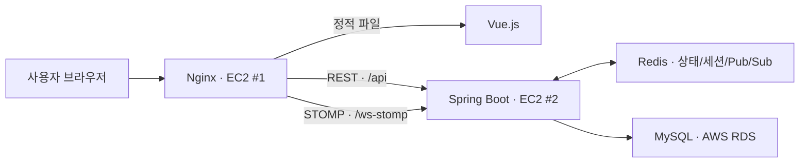
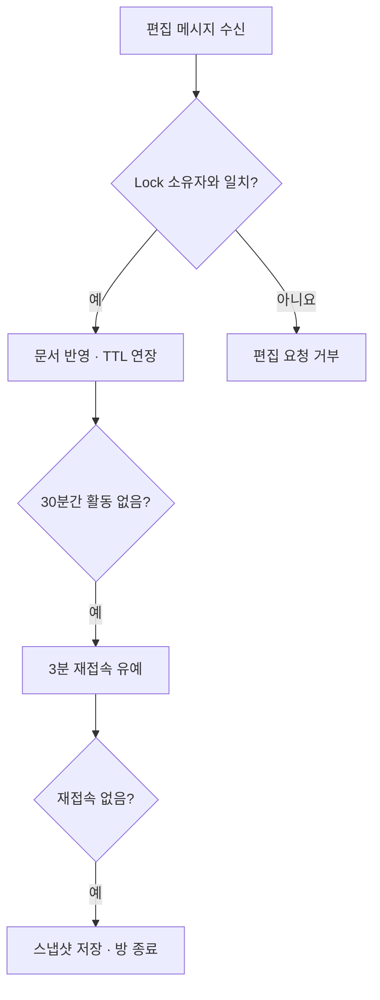

# OpenCanvas

> 한 명이 이야기를 이어 쓰고, 여러 사용자가 작성 과정을 실시간으로 관전하며 원하는 단락에서 새로운 이야기로 확장할 수 있는 웹 서비스입니다.

[배포 서비스 바로가기](http://ec2-43-201-95-35.ap-northeast-2.compute.amazonaws.com/)

## 프로젝트 소개

OpenCanvas는 완성된 글만 공유하는 서비스가 아니라, **글이 만들어지는 과정과 서로 다른 전개를 함께 경험하는 서비스**입니다.

- 단락을 선택해 해당 지점까지의 내용을 이어받은 새 이야기를 만들 수 있습니다.
- 한 명이 작성하는 동안 다른 사용자는 변경 내용을 실시간으로 관전합니다.
- Redis로 편집 권한과 작성 중인 문서를 관리하고, 비정상 이탈에도 방이 정리되도록 설계했습니다.
- OAuth2 로그인 이후 발급한 JWT를 REST API와 WebSocket에서 동일하게 검증합니다.

## 기여 범위

초기에는 팀 프로젝트로 시작했으며, 현재 배포된 최종 버전의 Backend · Frontend · Infra 전체를 단독으로 재구현했습니다.

## 주요 기능

| 기능 | 설명 |
| --- | --- |
| 이야기 확장 및 분기 | 원하는 단락을 선택해 그 지점부터 새로운 버전의 이야기를 작성합니다. |
| 실시간 관전 | 편집자가 작성 중인 문단을 WebSocket(STOMP)으로 관전자에게 전달합니다. |
| 단일 편집자 제어 | Redis Lock으로 한 방에 한 명만 편집할 수 있도록 제한합니다. |
| 작성 상태 복구 | 입장 시 Redis 스냅샷을 조회해 기존 문단과 순서를 복원합니다. |
| oauth2 + jwt | Google OAuth2 로그인 후 Access Token과 Refresh Token을 발급합니다. |

## 기술 스택

| 구분 | 기술 |
| --- | --- |
| Backend | Java 17 · Spring Boot · JPA · Spring Security · OAuth2 · JWT |
| Real-time | WebSocket · STOMP · Redis Pub/Sub |
| Data | MySQL, Redis |
| Frontend | Vue.js |
| Infra / DevOps | AWS EC2 · RDS · Docker · Nginx · GitHub Actions |

## 시스템 아키텍처



- Nginx를 외부 요청의 단일 진입점으로 두고 REST API와 WebSocket 요청을 Backend 서버로 전달합니다.

## 핵심 구현

### 1. Redis Lock과 TTL을 이용한 편집 권한 관리

편집자가 브라우저를 강제 종료하거나 네트워크가 끊기면 정상적인 종료 메시지가 도착하지 않아, 편집 권한과 방 상태가 남을 수 있었습니다. 연결 종료 이벤트에만 의존하지 않고 Redis TTL 만료를 상태 전이의 기준으로 사용했습니다.

| Redis Key | TTL | 역할 |
| --- | ---: | --- |
| `editorSubject:{roomId}` | 1일 | 현재 편집자를 식별하며 NX 옵션입니다.|
| `lock:document:{roomId}` | 30분 | 편집 권한을 나타내며 편집 메시지 수신 시 TTL을 연장합니다. |
| `disconnect:{subject}` | 3분 | 일시적인 연결 끊김과 실제 이탈을 구분하는 재접속 유예 키입니다. |



이를 통해 정상 편집 중에는 권한이 유지되고, 비정상 이탈 시에도 일정 시간이 지나면 편집 상태와 방이 자동으로 정리됩니다.

### 2. 전체 문서 전송에서 문단 단위 동기화로 개선

처음에는 입력할 때마다 전체 문서를 전송했습니다. 문서가 길어질수록 매 메시지의 크기가 함께 커졌고, 같은 문단이 반복 전송되는 문제가 있었습니다.

다음과 같이 변경했습니다.

- 변경된 문단만 전송하고 연속 입력에는 **700ms debounce**를 적용했습니다.
- Enter 입력과 작성 종료 시에는 대기 중인 변경 내용을 즉시 전송합니다.
- 메시지에 `paragraphId`와 `afterParagraphId`를 포함해 삽입 위치를 명시합니다.
- Redis Hash에는 `paragraphId → 문단 내용`, Redis List에는 문단 ID의 순서를 저장합니다.
- 새 관전자는 입장 시 스냅샷을 먼저 조회한 뒤 이후 실시간 메시지를 구독합니다.

```text
SNAPSHOT:{roomId}        Hash  paragraphId -> paragraph body
SNAPSHOT_ORDER:{roomId}  List  [paragraphId1, paragraphId2, ...]
```

마지막 문단 추가는 `RPUSH`로 처리하고, 중간 삽입은 `afterParagraphId`를 찾아 `LINSERT`로 처리했습니다. 전송량은 전체 문서 크기가 아니라 **변경된 문단 크기**에 비례하며, 뒤늦게 입장한 사용자도 기존 상태를 복원할 수 있습니다.

### 3. OAuth2·JWT 기반 인증 및 토큰 재발급

Google OAuth2 로그인 성공 후 사용자 식별 정보를 Claim에 포함한 Access Token과 Refresh Token을 발급했습니다. 발급한 JWT는 REST API와 WebSocket 연결에서 각각 검증하며, Access Token이 만료된 경우에는 Refresh Token으로 재발급한 뒤 실패했던 요청을 다시 실행하도록 구현했습니다.

- **REST API**: `JwtAuthenticationFilter`에서 토큰을 검증하고 `SecurityContext`에 인증 정보를 설정합니다.
- **WebSocket**: `STOMP CONNECT` 인터셉터에서 토큰을 검증한 뒤 사용자와 WebSocket 세션을 매핑합니다.
- **접근 제어**: `SecurityFilterChain`으로 URL별 접근 권한을 설정하고, 로그인과 토큰 재발급 경로만 인증 대상에서 제외했습니다.
- **토큰 재발급**: Access Token 만료로 401 응답을 받으면 Axios 인터셉터에서 Refresh Token을 이용해 새로운 Access Token을 발급받고, 실패했던 기존 요청을 한 번 재시도합니다.

재시도한 요청에는 별도의 상태 값을 표시해 동일한 요청에서 토큰 재발급이 반복되지 않도록 처리했습니다.

### 4. 계층 조회와 목록 집계 쿼리 개선

#### 재귀 CTE로 분기 경로 조회

선택한 이야기의 부모를 루트까지 애플리케이션에서 반복 조회하면 노드 깊이만큼 DB 왕복이 발생합니다. MySQL 재귀 CTE로 조상 노드를 탐색해 **N회의 조회를 1회의 쿼리로 단일화**했습니다.

시작 노드는 `writings(title, depth, siblingIndex)` 조건으로 탐색하므로 해당 컬럼에 복합 인덱스를 적용해 조회 범위를 줄였습니다.

#### 페이징 이후 좋아요 집계

커버 목록과 좋아요 수를 한 번에 JOIN하면 전체 데이터를 집계한 뒤 페이징하게 됩니다. 먼저 커버 ID를 페이징하고, 해당 ID만 `IN (:ids)` 조건으로 집계하는 두 단계 조회로 변경했습니다.

조회 조건에 맞춰 `likes(content_id, user_id)`, `contents(cover_id)` 인덱스도 추가해 불필요한 탐색 범위를 줄였습니다.

### 5. AWS 배포와 CI/CD 자동화

반복되는 빌드와 배포 작업을 github action을 통해 자동화하여 배포 편의성을 높였습니다.
백엔드는 빌드 성공후에도 웹이 정상가동 되지 않은 경우가 있어 헬스 체크를 도입하였습니다.

[백엔드]
* Docker 이미지 빌드 및 Docker Hub 업로드
* Nginx를 경유한 헬스 체크로 배포 결과 검증

[프론트엔드]
* Nginx 정적 파일 경로에 배포
* Nginx 설정 검증 후 reload